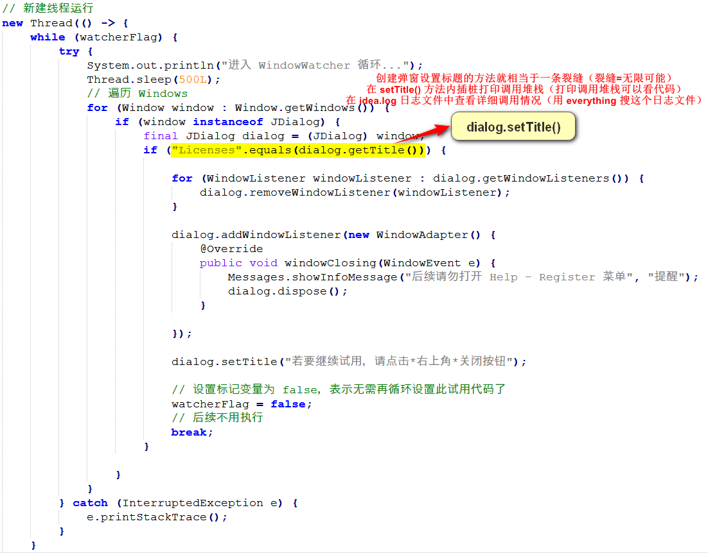

## 说明

使用 `Javaagent` + `ASM` 实现无侵入动态修改类方法。ASM 使用 JDK 自带的版本，无需引入其他依赖，大幅减小 jar 包文件大小。

可应用在 IDEA 启动时，未激活/未试用/试用到期状态下，自动去掉 Licenses（许可证）弹窗，达到【无限试用】的效果。

目前仅短期测试了以下版本正常使用，其他开发工具/版本请自行修改测试。
- IDEA 2023.3.6+
- IDEA 2024.1.1+

本项目**仅供技术参考学习**！有条件的**请支持正版**或申请优惠渠道！

 

## 使用

1. 官网下载对应版本的 IDEA，建议下载压缩包版本
2. 下载部署 Oracle JDK 17 / Open JDK 17 环境，或者直接使用 IDEA 自带的 Open JDK 17
3. 下载配置 Maven 3.6.3 （或更高版本）
4. `git clone url` 克隆项目到本地
5. IDEA 打开项目（打开 `doidea-asm` 文件夹即可），Maven package 打包
6. target 目录下的 `doidea-asm-2.0.0.jar` 为可用 jar 包，复制到一个目录，比如：`E:\DevRes\doidea`
7. `doidea.properties` 为全局配置文件，==**需手动复制到插件同级目录**==，否则插件不能正常运行
8. `idea64.exe.vmoptions` 添加以下 3 条配置，即可生效
   1. -javaagent:E:\DevRes\doidea\doidea-asm-2.0.0.jar
   2. --add-opens=java.base/jdk.internal.org.objectweb.asm=ALL-UNNAMED
   3. --add-opens=java.base/jdk.internal.org.objectweb.asm.tree=ALL-UNNAMED

 

**ASM 相关代码报错问题**

> - 在 XxxTransformer 类文件中 `import jdk.internal.org.objectweb.asm.*;` 可能会报错，但不影响 Maven package 打包
> - 在 `import jdk.internal.org.objectweb.asm.*;` 这一行，按 `Alt + Enter`，选择 `--add-exports java.base/jdk.internal.org.objectweb.asm=ALL-UNNAMED` 添加到模块编译器选项，即可不报错
> - 也可以到 `文件-设置-构建、执行、部署-编译器-Java编译器` 最下方的 `模块-编译选项` 中手动配置

 

**如果出现“试用已到期”提示弹窗，解决方案 👇**

> 1. 最开始就不点试用，直接用这个工具
> 2. 点了试用，但还没到期，先去移除试用许可就行了
> 3. **试用了且到期了**，删除 C:\Users\xxx\AppData\Roaming\JetBrains\IntelliJIdea2024.x\idea.key 这个文件即可

 

**怎样找到要修改的关键位置？**

> 1. 找到裂缝：也就是BUG漏洞，从这里打开程序内部的世界
> 2. 插桩打印日志：从裂缝定位到关键方法，在方法执行前打印调用堆栈(new RuntimeException().printStackTrace();)
> 3. 看日志定位关键：在 `C:\Users\xxx\AppData\Local\JetBrains\IntelliJIdea2024.x\log\idea.log` 日志文件中，查看调用堆栈，找到关键类和方法
> 4. 类文件在哪个jar包：在 IDEA 安装目录的 lib 目录下，可以逐个用压缩软件打开查看对应包名路径；也可以先把 lib 下的所有 jar 包都解压，然后用 everything 搜索 `类名.class`
> 5. jadx反编译jar包：把目标 jar 包用 jadx 反编译，根据包名路径找到关键类，然后根据日志堆栈中的行号找到具体的方法
> 6. Java代码生成ASM代码：使用 IDEA 插件 `ASM Bytecode Viewer`，在测试类（AsmTest.java）写好修改代码，在这个文件右键，选择 `ASM Bytecode Viewer`，等待编译完成，ASMPlugin 窗口切换到 ASMified，找到对应的方法块，就能得到ASM代码了
> 7. 温馨提示：研究折腾很容易废寝忘食，熬夜通宵、黑白颠倒，对身体很不好！！

 

**找到裂缝 -> 无限可能 🔍**

（在 [Jexbraxxs系列破解思路的详细实现步骤探索](https://www.52pojie.cn/thread-1921814-1-1.html) 这个贴子中找到了『裂缝』）

 

（广州越秀公园古城墙上的🌳）

 

## 参考

- [ASM 官网](https://asm.ow2.io/)
- [Java ASM系列](https://lsieun.github.io/java/asm/)
- [通过实战走近Java Agent探针技术](https://juejin.cn/post/7025410644463583239)
- [字节码增强技术探索](https://tech.meituan.com/2019/09/05/java-bytecode-enhancement.html)
- [Jexbraxxs系列破解思路的详细实现步骤探索](https://www.52pojie.cn/thread-1921814-1-1.html)
- [JexBraxxs 全家桶系列 2024 破解思路](https://www.52pojie.cn/thread-1919098-1-1.html)
- [javaagent+asm破解cexxum](https://www.cnblogs.com/alinainai/p/12188496.html)

 
